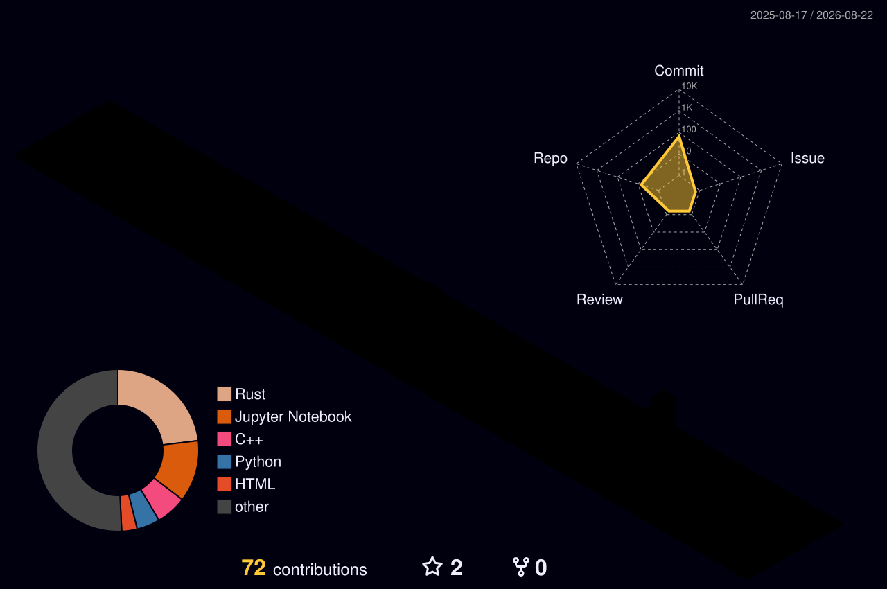

  

  
  

<!-- --- -->

  <em>AI Software & System Engineer · Full Stack Developer · Problem Solver</em>

---

## 🙋 About Me

- 🔭 I’m currently working on AI projects
- 🌱 I’m currently learning AI courses like DeepLearning, ComputerVision, Rag.
- 👯 I’m looking to collaborate on AI projects.
- 🤔 I’m looking for help with AI projects.
- 💬 Ask me about Machine & Deep Learning

---

## Programming Languages & Tools

  

---

## 📊 GitHub Stats

  
  

  

---

## 📫 How to reach me:
  
  

---

---

  

---

  

---

<picture>
  <source media="(prefers-color-scheme: dark)" srcset="https://raw.githubusercontent.com/AhmedIbrahimFCAL/AhmedIbrahimFCAL/pacman-output/pacman-contribution-graph-dark.svg">
  <source media="(prefers-color-scheme: light)" srcset="https://raw.githubusercontent.com/AhmedIbrahimFCAL/AhmedIbrahimFCAL/pacman-output/pacman-contribution-graph.svg">
  
</picture>
